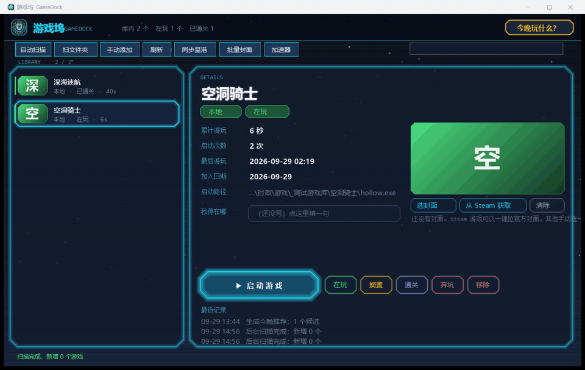

<div align="center">

# GameDock

**Steam tells you what you own. GameDock tells you what you play tonight.**

A Windows desktop game library manager built around one question other launchers ignore.

[English](README.md) | [简体中文](README.zh-CN.md)



</div>

---

## The problem

My Steam library has 200+ games. About once a week I would sit down, scroll through the
whole list, and end up closing the computer and scrolling my phone instead.

It was never a lack of games. It was a **lack of a decision**.

GameDock only tries to fix that.

## Features

- **Aggregates your libraries** — scans Steam (including library folders on every drive),
  Epic, and any folder you point it at, into one list
- **Tracks playtime** across all of them, not just the games from one store
- **"What to play tonight"** — scores every game by playtime, status, and how long it has
  been idle, then returns a short list
- **Progress notes** — write down where you stopped (*"chapter 3, just beat the boss,
  sneak is Ctrl"*). Launch a game you haven't touched in a while and GameDock shows it
  back to you before starting
- **Cover art** — set your own image, or fetch the official Steam header image
- **Console app detection** — some "games" are console programs. GameDock reads the PE
  subsystem and can hide the console window on launch

### How the scoring works

There is no machine learning here, on purpose. The rule is written down and you can argue with it:

```
status: playing +60 / shelved +25 / unclassified +15
just started (under 3h)      +20
heavily played (over 60h)    +10
idle over 30 days            +18
idle 7-30 days               +10
played within 24 hours       -25
plus a small random jitter
```

The top three become the short list. A recommendation you can't reproduce is a
recommendation you stop trusting by the second day — so this one is deterministic.

## How this differs from Playnite

[Playnite](https://playnite.link) is excellent and does far more than this project:
libraries, themes, extensions, emulators, metadata providers.
**If you want a complete library manager, go use Playnite.**

GameDock deliberately does less. It only adds the two layers Playnite doesn't have:

| Layer | What it means |
| --- | --- |
| **Decision** | Answers "what should I play tonight", not "what do I own" |
| **Memory** | Progress notes that resurface when you return to a shelved game |

## Honest limitations

- **Windows only**
- **The UI is Chinese.** Localization is not implemented yet — see Roadmap
- The interface is drawn by hand with GDI+, no UI framework. It looks unusual, and it is
  not DPI-perfect on every display
- **No installer.** Download the zip, or build it yourself
- Scanning a Steam library on a slow removable drive can take 20+ seconds. It runs on a
  background thread so the window never freezes, but it is slow
- Steam achievements are **not** read yet, so a game's progress can only be a text note

## Download

Get the latest zip from [Releases](../../releases). Unzip anywhere and run `GameDock.exe`.
No installation, no administrator rights.

## Build

Requires .NET Framework 4.x (ships with Windows). No Visual Studio, no NuGet,
no third-party dependencies.

```
build.bat
```

That produces `GameDock.exe`.

## Where your data lives

Everything is under `%APPDATA%\GameDock`. **Nothing is uploaded anywhere.**

The only time the app touches the network is when you click "从 Steam 获取" to download
a cover image, or when you explicitly ask it to check your Steam library.

## Roadmap

- [ ] Localization — extract UI strings, then accept community translations
- [ ] Time-budget recommendations — "I only have 90 minutes tonight"
- [ ] Feedback loop so the scoring learns from what you actually play
- [ ] Read Steam achievements to turn progress notes into real progress percentages
- [ ] Installer

## License

[MIT](LICENSE)
